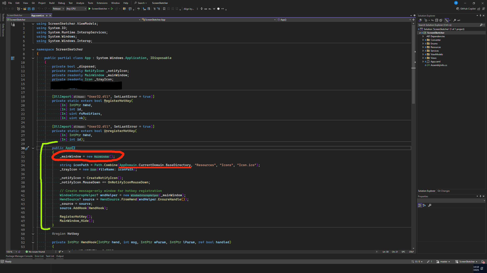

# ScreenSketcher



An easy-to-use lightweight screenshot tool that allows you to draw directly on the screen.
It is ideal for presentations and demonstrations.
Based on WPF .NET 8.0

## Features


- 🎨 Screen drawing
- 🖌️ Multiple drawing tools:
	- Brush
	- Highlighter
	- Eraser
- 🎯 Color picker with transparency (PixiEditor/ColorPicker)
- ↔️ Adjust brush size 
- 💾 Save screenshot with drawings as PNG
- ↩️ Undo/Redo
- 🎮 Quick activation with Hotkey

## Installation

1. Download from latest release:
2. Run installer (ScreenSketcher_Setup_X.X.X.exe)
3. Launch ScreenSketcher
4. ScreenSketcher will show in your system tray

## Instructions

- `CTRL + F8` or from the system tray click and open drawing window
- `CTRL + Mouse Wheel` to change brush size
- `CTRL + Z/Y` for undo & redo drawing
- `CTRL + N` for new drawing
- `ESC` to close and reset drawing overlay
- `CTRL + S` to save screenshot with drawings
- Use the toolbar to change the tool/brush and color

## Upcoming Features

- 📐 Basic shapes (rectangle, circle, arrow)
- 📝 Text tool for labels
- 🖼️ Multiple monitor support
- 🎨 More brush styles
- ⚙️ Configurable hotkeys + Settings
- 🌈 Preset color palettes

## Dependencies
- PixiEditor.ColorPicker
- Microsoft.Xaml.Behaviors.Wpf
- Ookii.Dialogs.Wpf
- Refractored.MvvmHelpers

## Building from Source

### Prerequisites
- Visual Studio 2022
- .NET 8.0 SDK
- Windows 10/11

### Build Steps
1. Clone the repository
```bash
git clone https://github.com/yourusername/ScreenSketcher.git
